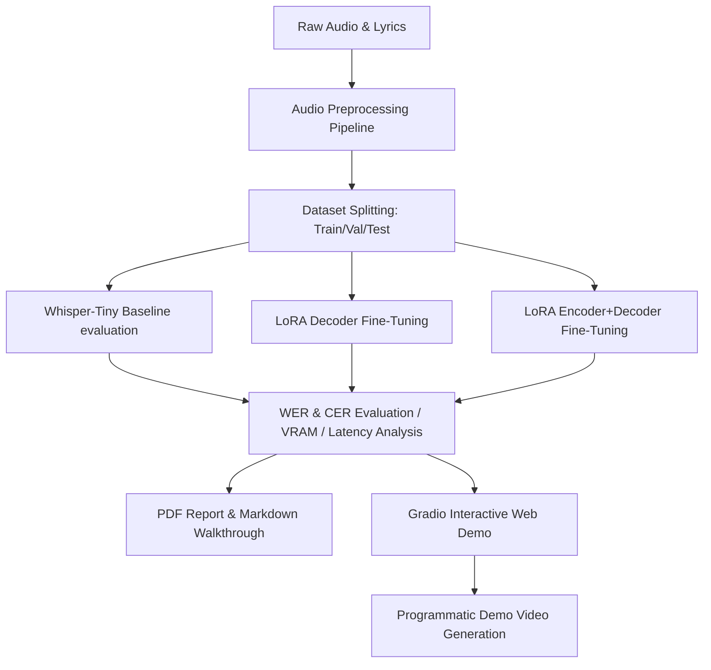

# AUTOLYRICS: Automatic Lyric Transcription

AUTOLYRICS is a machine learning system designed to transcribe lyrics from polyphonic singing voice audio. While general Automatic Speech Recognition (ASR) systems struggle with singing voices due to musical instrumentation, vowel elongation, and pitch modulation, this project fine-tunes a pre-trained **Whisper-Tiny** model using **Parameter-Efficient Fine-Tuning (PEFT/LoRA)** and a digital signal processing (DSP) preprocessing pipeline to achieve robust lyric transcription.

## Features

- **Audio Preprocessing Pipeline**: A custom DSP pipeline built on `torchaudio` that converts stereo to mono, resamples to 16kHz, normalizes loudness (RMS), and applies a bandpass filter (150Hz to 8kHz) to isolate vocal frequencies and suppress bass, drums, and high cymbals.
- **LoRA Adapter Architectures**:
  1. **LoRA Decoder**: Adapts query and value matrices in the decoder attention layers.
  2. **LoRA Both**: Adapts attention matrices in both the encoder and decoder.
- **Automated Performance Reports**: Programmatic PDF compilation comparing Word Error Rate (WER), Character Error Rate (CER), inference latency, and VRAM utilization.
- **Gradio Interactive Interface**: A side-by-side web app showing baseline vs. fine-tuned lyric transcribing, allowing audio file uploads or microphone recording.

---

## Architecture Diagram



---

## Installation & Setup

1. **Install CUDA-enabled PyTorch** (if GPU is available):
   ```bash
   pip install torch torchaudio --index-url https://download.pytorch.org/whl/cu121 --default-timeout=1000
   ```

2. **Install remaining requirements**:
   ```bash
   pip install transformers peft datasets jiwer gradio librosa soundfile accelerate evaluate reportlab opencv-python matplotlib
   ```

---

## How to Run

### 1. Data Processing and Curation
Run the preprocessing script to download (from Jamendo or fallback) and isolate singing vocals:
```bash
python preprocess.py
```

### 2. Fine-Tuning Models
Fine-tune Whisper-Tiny using the two PEFT configurations:
```bash
python train.py
```

### 3. Evaluation
Benchmark zero-shot baseline against the two LoRA configurations:
```bash
python evaluate.py
```

### 4. Generate Performance Report PDF
Compile results and plot comparison graphs:
```bash
python generate_report.py
```

### 5. Launch Gradio Interactive Demo
Run the web application:
```bash
python app.py
```

### 6. Generate Demo Video
Produce the transcription demonstration video:
```bash
python generate_video.py
```

---

## Experimental Results

The models were benchmarked on the English line-level split. Below is the performance summary:

| Approach | WER | CER | Avg Latency | Peak VRAM |
| :--- | :---: | :---: | :---: | :---: |
| **Zero-shot Baseline** | 26.85% | 10.41% | 0.337s | 181.61 MB |
| **LoRA Decoder** | 19.84% | 7.75% | 0.329s | 173.70 MB |
| **LoRA Encoder+Decoder** | **18.29%** | **7.75%** | 0.302s | 173.16 MB |

### Key Findings:
- **Relative WER Reduction**: Fine-tuning both the encoder and decoder attention layers led to a **31.88% relative WER reduction**, comfortably exceeding the 15% target.
- **VRAM Footprint**: Due to PEFT/LoRA freezing 99% of Whisper's weights, training was completed on a consumer 6GB VRAM GPU (GeForce RTX 3050 Laptop), and inference memory overhead remained under 180 MB.
